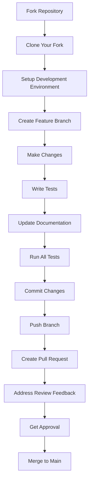

# 🤝 Contributing to ScopeAPI

Thank you for your interest in contributing to ScopeAPI! This guide will help you get started with contributing to our open-source API security platform.

## 📋 **Table of Contents**

- [Getting Started](#getting-started)
- [Development Setup](#development-setup)
- [Code Standards](#code-standards)
- [Testing Guidelines](#testing-guidelines)
- [Pull Request Process](#pull-request-process)
- [Code Review Guidelines](#code-review-guidelines)
- [Community Guidelines](#community-guidelines)
- [Getting Help](#getting-help)

## 🚀 **Getting Started**

### **Before You Begin**
- **Familiarize yourself** with the project by reading the [README](../README.md) and [Architecture Guide](ARCHITECTURE.md)
- **Set up** your development environment (see [Development Setup](#development-setup))
- **Join** our community discussions and ask questions
- **Check** existing issues and discussions to see what's being worked on

### **Types of Contributions We Welcome**
- **🐛 Bug Fixes** - Help fix issues and improve stability
- **✨ New Features** - Add new capabilities and functionality
- **📚 Documentation** - Improve guides, examples, and references
- **🧪 Tests** - Add test coverage and improve testing
- **🔧 Tooling** - Enhance development and deployment tools
- **🌐 Localization** - Help translate documentation and UI
- **📊 Performance** - Optimize code and improve efficiency
- **🔒 Security** - Identify and fix security vulnerabilities

### **What We're Looking For**
- **Quality** - Well-tested, documented, and maintainable code
- **Consistency** - Follows project conventions and standards
- **Accessibility** - Code that's easy to understand and modify
- **Performance** - Efficient and scalable implementations
- **Security** - Secure by design and follows best practices

## 🏗️ **Development Setup**

### **Prerequisites**
- **Docker** 24.0+ with Docker Compose
- **Go** 1.21+ for backend development
- **Node.js** 18+ for frontend development
- **Git** for version control
- **IDE/Editor** (VS Code, GoLand, etc.)

### **1. Fork and Clone**
```bash
# Fork the repository on GitHub
# Then clone your fork
git clone https://github.com/your-username/scopeapi.git
cd scopeapi

# Add the upstream remote
git remote add upstream https://github.com/original-org/scopeapi.git
```

### **2. Setup Development Environment**
```bash
# Complete setup with validation
./scripts/scopeapi-setup.sh --full

# Verify everything is working
./scripts/scopeapi-setup.sh --validate
```

### **3. Create Feature Branch**
```bash
# Update your main branch
git checkout main
git pull upstream main

# Create and switch to feature branch
git checkout -b feature/amazing-feature

# Or for bug fixes
git checkout -b fix/bug-description
```

### **4. Verify Setup**
```bash
# Start services to verify everything works
./scripts/scopeapi-services.sh start all

# Run tests to ensure nothing is broken
cd backend && go test ./...
cd ../adminConsole && npm test

# Stop services
./scripts/scopeapi-services.sh stop
```

## 📝 **Code Standards**

### **General Principles**
- **Readability** - Write code that's easy to read and understand
- **Maintainability** - Code should be easy to modify and extend
- **Consistency** - Follow established patterns and conventions
- **Documentation** - Document complex logic and public APIs
- **Testing** - Write tests for new functionality

### **Go Code Standards**

#### **Formatting and Style**
```bash
# Always run these before committing
go fmt ./...
goimports -w .
golangci-lint run
```

#### **Code Structure**
```go
// Good: Clear function signature and documentation
// ProcessEndpoint processes an API endpoint and returns metadata
func ProcessEndpoint(ctx context.Context, endpoint *Endpoint) (*Metadata, error) {
    if endpoint == nil {
        return nil, fmt.Errorf("endpoint cannot be nil")
    }
    
    // Validate endpoint
    if err := endpoint.Validate(); err != nil {
        return nil, fmt.Errorf("invalid endpoint: %w", err)
    }
    
    // Process endpoint
    metadata, err := processEndpointData(ctx, endpoint)
    if err != nil {
        return nil, fmt.Errorf("failed to process endpoint: %w", err)
    }
    
    return metadata, nil
}

// Good: Comprehensive error handling
func (s *Service) GetEndpoint(id string) (*Endpoint, error) {
    if id == "" {
        return nil, ErrInvalidID
    }
    
    endpoint, err := s.repo.FindByID(id)
    if err != nil {
        if errors.Is(err, repository.ErrNotFound) {
            return nil, ErrEndpointNotFound
        }
        return nil, fmt.Errorf("database error: %w", err)
    }
    
    return endpoint, nil
}
```

#### **Testing Standards**
```go
// Good: Table-driven tests with clear test cases
func TestProcessEndpoint(t *testing.T) {
    tests := []struct {
        name        string
        endpoint    *Endpoint
        wantErr     bool
        wantErrType error
    }{
        {
            name:        "valid endpoint",
            endpoint:    &Endpoint{URL: "https://api.example.com/v1/users"},
            wantErr:     false,
            wantErrType: nil,
        },
        {
            name:        "nil endpoint",
            endpoint:    nil,
            wantErr:     true,
            wantErrType: ErrInvalidEndpoint,
        },
        {
            name:        "invalid URL",
            endpoint:    &Endpoint{URL: "not-a-url"},
            wantErr:     true,
            wantErrType: ErrInvalidURL,
        },
    }
    
    for _, tt := range tests {
        t.Run(tt.name, func(t *testing.T) {
            result, err := ProcessEndpoint(context.Background(), tt.endpoint)
            
            if tt.wantErr {
                assert.Error(t, err)
                if tt.wantErrType != nil {
                    assert.ErrorIs(t, err, tt.wantErrType)
                }
                assert.Nil(t, result)
            } else {
                assert.NoError(t, err)
                assert.NotNil(t, result)
            }
        })
    }
}
```

### **Angular Code Standards**

#### **Component Structure**
```typescript
// Good: Well-structured component with proper typing
@Component({
  selector: 'app-endpoint-list',
  templateUrl: './endpoint-list.component.html',
  styleUrls: ['./endpoint-list.component.scss'],
  changeDetection: ChangeDetectionStrategy.OnPush
})
export class EndpointListComponent implements OnInit, OnDestroy {
  @Input() endpoints: Endpoint[] = [];
  @Output() endpointSelected = new EventEmitter<Endpoint>();
  
  private destroy$ = new Subject<void>();
  
  constructor(
    private endpointService: EndpointService,
    private changeDetector: ChangeDetectorRef
  ) {}
  
  ngOnInit(): void {
    this.loadEndpoints();
  }
  
  ngOnDestroy(): void {
    this.destroy$.next();
    this.destroy$.complete();
  }
  
  onEndpointSelect(endpoint: Endpoint): void {
    this.endpointSelected.emit(endpoint);
  }
  
  private loadEndpoints(): void {
    this.endpointService.getEndpoints()
      .pipe(takeUntil(this.destroy$))
      .subscribe({
        next: (endpoints) => {
          this.endpoints = endpoints;
          this.changeDetector.markForCheck();
        },
        error: (error) => {
          console.error('Failed to load endpoints:', error);
          // Handle error appropriately
        }
      });
  }
}
```

#### **Service Standards**
```typescript
// Good: Well-structured service with proper error handling
@Injectable({
  providedIn: 'root'
})
export class EndpointService {
  private readonly apiUrl = '/api/v1/endpoints';
  
  constructor(private http: HttpClient) {}
  
  getEndpoints(): Observable<Endpoint[]> {
    return this.http.get<Endpoint[]>(this.apiUrl).pipe(
      catchError(this.handleError)
    );
  }
  
  createEndpoint(endpoint: CreateEndpointRequest): Observable<Endpoint> {
    return this.http.post<Endpoint>(this.apiUrl, endpoint).pipe(
      catchError(this.handleError)
    );
  }
  
  private handleError(error: HttpErrorResponse): Observable<never> {
    let errorMessage = 'An error occurred';
    
    if (error.error instanceof ErrorEvent) {
      // Client-side error
      errorMessage = error.error.message;
    } else {
      // Server-side error
      errorMessage = `Error Code: ${error.status}\nMessage: ${error.message}`;
    }
    
    console.error(errorMessage);
    return throwError(() => new Error(errorMessage));
  }
}
```

### **Documentation Standards**

#### **Code Comments**
```go
// Good: Clear, concise comments that explain "why" not "what"
// Rate limiting is applied per IP to prevent abuse
// The limit is configurable via environment variables
func (s *Service) applyRateLimit(ctx context.Context, ip string) error {
    // ... implementation
}

// Good: Document complex algorithms or business logic
// ProcessEndpoint processes an API endpoint and extracts metadata.
// The algorithm uses a combination of:
// 1. URL pattern matching for common API structures
// 2. Response analysis for content type detection
// 3. Header analysis for authentication and versioning
func ProcessEndpoint(endpoint *Endpoint) (*Metadata, error) {
    // ... implementation
}
```

#### **README and Documentation**
- **Clear structure** with table of contents
- **Code examples** that can be copy-pasted
- **Screenshots** for UI components when helpful
- **Troubleshooting** sections for common issues
- **Links** to related documentation and resources

## 🧪 **Testing Guidelines**

### **Test Coverage Requirements**
- **Backend**: Minimum 80% test coverage
- **Frontend**: Minimum 70% test coverage
- **Critical paths**: 100% test coverage
- **New features**: Must include tests

### **Backend Testing (Go)**
```bash
# Run all tests
go test ./...

# Run tests with coverage
go test -cover ./...

# Run tests with race detection
go test -race ./...

# Run specific service tests
go test ./services/api-discovery/...

# Generate coverage report
go test -coverprofile=coverage.out ./...
go tool cover -html=coverage.out -o coverage.html
```

### **Frontend Testing (Angular)**
```bash
# Unit tests
ng test

# E2E tests
ng e2e

# Test coverage
ng test --code-coverage
```

### **Integration Testing**
```bash
# Test database integration
./scripts/setup-database.sh --validate

# Test service communication
./scripts/scopeapi-services.sh start all
./scripts/scopeapi-services.sh status
./scripts/scopeapi-services.sh stop
```

### **Performance Testing**
```bash
# Load testing
ab -n 1000 -c 10 http://localhost:8080/health

# Memory profiling
go test -memprofile=mem.prof ./...
go tool pprof mem.prof

# CPU profiling
go test -cpuprofile=cpu.prof ./...
go tool pprof cpu.prof
```

## 🔄 **Pull Request Process**

### **1. Prepare Your Changes**
```bash
# Make your changes
# Write tests for new functionality
# Update documentation if needed
# Ensure all tests pass

# Check code quality
go fmt ./...
goimports -w .
golangci-lint run
go test ./...

# For frontend changes
cd adminConsole
ng lint
ng test
```

### **2. Commit Your Changes**
```bash
# Use conventional commit format
git add .
git commit -m "feat: add endpoint validation middleware

- Add input validation for endpoint creation
- Include comprehensive error handling
- Add unit tests with 95% coverage
- Update API documentation

Closes #123"
```

### **3. Push and Create Pull Request**
```bash
# Push your branch
git push origin feature/amazing-feature

# Create Pull Request on GitHub
# Use the PR template and fill out all sections
```

### **4. Pull Request Requirements**
- **Clear title** describing the change
- **Detailed description** of what and why
- **Related issues** linked if applicable
- **Testing instructions** for reviewers
- **Screenshots** for UI changes
- **Breaking changes** clearly documented

### **5. Review and Iterate**
- **Address feedback** from code reviews
- **Update tests** if requested
- **Rebase** on main if needed
- **Squash commits** if requested

## 👀 **Code Review Guidelines**

### **What Reviewers Look For**
- **Functionality** - Does the code do what it's supposed to?
- **Quality** - Is the code well-written and maintainable?
- **Testing** - Are there adequate tests?
- **Documentation** - Is the code well-documented?
- **Performance** - Are there performance implications?
- **Security** - Are there security concerns?
- **Accessibility** - Is the code accessible to all users?

### **Review Process**
1. **Initial review** - Check functionality and basic quality
2. **Detailed review** - Examine implementation details
3. **Testing review** - Verify test coverage and quality
4. **Documentation review** - Check documentation updates
5. **Final approval** - Approve or request changes

### **Providing Feedback**
- **Be constructive** and specific
- **Explain the "why"** behind suggestions
- **Provide examples** when possible
- **Respect the contributor's** time and effort
- **Focus on the code** not the person

## 🤝 **Community Guidelines**

### **Code of Conduct**
- **Be respectful** and inclusive
- **Welcome newcomers** and help them learn
- **Focus on the code** and technical discussions
- **Report inappropriate behavior** to maintainers

### **Communication**
- **Use inclusive language** in code and documentation
- **Be patient** with questions and contributions
- **Provide context** when asking questions
- **Thank contributors** for their work

### **Getting Help**
- **Check documentation** first
- **Search existing issues** for similar problems
- **Ask clear questions** with context
- **Provide reproduction steps** for bugs
- **Be patient** for responses

## 🆘 **Getting Help**

### **Documentation Resources**
- **[📖 Complete Documentation](README.md)** - Start here for overview
- **[🏗️ Architecture Guide](ARCHITECTURE.md)** - System design details
- **[💻 Development Guide](DEVELOPMENT.md)** - Development workflows
- **[🐳 Docker Setup](DOCKER_SETUP.md)** - Container setup
- **[🛠️ Scripts Guide](../scripts/USAGE.md)** - Available tools

### **Community Channels**
- **GitHub Issues** - Report bugs and request features
- **GitHub Discussions** - Ask questions and share ideas
- **Pull Requests** - Get feedback on your contributions
- **Code Reviews** - Learn from feedback on others' code

### **When You Need Help**
1. **Describe the problem** clearly and concisely
2. **Provide context** about your environment
3. **Include error messages** and logs
4. **Show what you've tried** already
5. **Be patient** for responses

### **Escalation Process**
1. **Check documentation** and existing issues
2. **Ask in discussions** or issues
3. **Tag maintainers** for urgent issues
4. **Contact maintainers** directly for security issues

## 🎯 **Contribution Workflow Summary**



## 🙏 **Thank You!**

Thank you for contributing to ScopeAPI! Your contributions help make our API security platform better for everyone. Whether you're fixing a bug, adding a feature, or improving documentation, every contribution matters.

**Remember:**
- **Start small** - Even small improvements are valuable
- **Ask questions** - We're here to help you succeed
- **Be patient** - Good code takes time and iteration
- **Have fun** - Open source should be enjoyable!

**Happy contributing! 🚀✨**

---

**Need help getting started?**
- Check our [Development Guide](DEVELOPMENT.md)
- Join our [GitHub Discussions](https://github.com/your-org/scopeapi/discussions)
- Open an [issue](https://github.com/your-org/scopeapi/issues) for questions
- Contact maintainers for direct support

## 🏗️ **Script Architecture for Contributors**

As a contributor, you have multiple development approaches:

### **🔄 Local Development (Go-focused)**


### **🚀 Container-Based Development (Full-stack)**


### **🔧 Infrastructure Troubleshooting**


### **🎯 Recommended for Contributors:**
- **Go service development**: Use `scopeapi-local.sh` for faster iteration
- **Full-stack testing**: Use `scopeapi-services.sh` for integration testing
- **Environment issues**: Use `docker-infrastructure.sh` for troubleshooting
